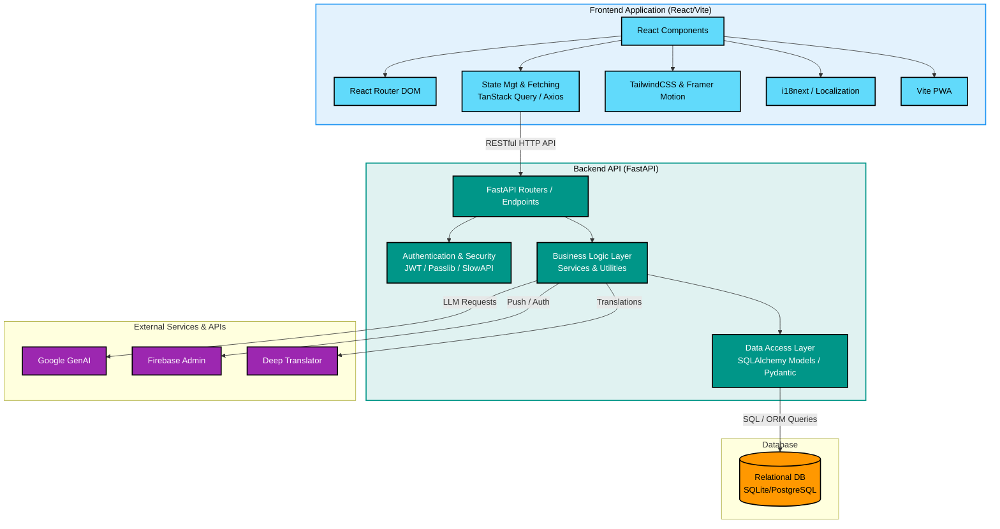

# Krishi Khata — Frontend

A mobile-first Progressive Web App (PWA) built for Indian farmers. It brings together a digital farm ledger (khata), live mandi prices, crop tracking, weather forecasts, and a community chat — all in one place, in Hindi and English.

Deployed on **Vercel**. Works offline after the first load.

---

## System Architecture

The following diagram illustrates how the frontend interacts with the backend and external services in the complete Krishi Khata ecosystem:



---

## What's Inside

### Pages

| Route | Page | What it does |
|---|---|---|
| `/` | Khata | Farm income/expense ledger with category filters |
| `/crops` | Crop Tracking | Sow, monitor, and close crop seasons with photo uploads |
| `/mandi` | Mandi Dashboard | Live and historical market prices with charts |
| `/weather` | Weather | AI-powered forecasts with farm-specific advisories |
| `/community` | Kisan Chaupal | Real-time community chat over WebSocket |

### Authentication

The app uses a **device-ID + PIN** flow — no phone number or email required. This was built for farmers who may not have or remember credentials.

1. First visit → Name and PIN setup screen (`WelcomeScreen`)
2. Return visit → PIN entry screen (`PinEntryScreen`)
3. Authenticated → Dashboard with all features

### Bilingual Support (Hindi / English)

All user-facing text is managed through `i18next`. You can switch languages from the top bar at any time. The underlying API calls always use English identifiers (e.g., `"seeds"`, `"fertilizer"`) so the database stays consistent regardless of the selected language.

### Mandi Price Tracker

- Searchable dropdowns for commodity and district (no free-text, so no spelling mismatches)
- A quick-select row shows the farmer's currently active crops as chips — tap one to instantly load its price history
- Price history is displayed as a line chart using Recharts

### Community Chat (WebSocket)

The chat connects over WebSocket with the farmer's JWT token passed as a query parameter. The client automatically handles the `http → ws` and `https → wss` protocol swap based on the API URL in the environment.

### PWA & Offline Support

The app is configured as a full PWA via `vite-plugin-pwa`. After the first load, the app shell and static assets are cached by the service worker. Workbox handles cache cleanup on updates.

---

## Tech Stack

| Category | Library / Tool |
|---|---|
| Framework | React 19, Vite 8 |
| Routing | React Router v7 |
| Data fetching | TanStack Query (React Query v5) |
| HTTP client | Axios |
| Styling | Tailwind CSS v4 |
| Charts | Recharts |
| Animations | Framer Motion |
| i18n | i18next, react-i18next, i18next-http-backend |
| Icons | Lucide React |
| Notifications | react-hot-toast |
| PWA | vite-plugin-pwa (Workbox) |

---

## Getting Started

### Prerequisites

- Node.js 18 or higher
- The backend server running (see `/server/README.md`)

### 1. Install dependencies

```bash
cd agroo/client
npm install
```

### 2. Configure environment

Create a `.env` file in the `client/` folder:

```env
# URL of the backend API
VITE_API_BASE_URL=http://localhost:8001

# For production, point this to your deployed backend:
# VITE_API_BASE_URL=https://your-backend.onrender.com
```

### 3. Run locally

```bash
npm run dev
```

Opens at `http://localhost:5173`.

### 4. Build for production

```bash
npm run build
```

Output goes to `dist/`. Deploy that folder to Vercel (or any static host).

---

## Folder Structure

```
client/
├── public/
│   ├── locales/
│   │   ├── en/             # English translation files
│   │   └── hi/             # Hindi translation files
│   ├── brand/              # Logo and brand assets
│   ├── illustrations/      # Onboarding and empty-state SVGs
│   └── stages/             # Crop growth stage images
├── src/
│   ├── api/                # Axios instance and per-feature API calls
│   ├── components/
│   │   ├── layout/         # TopBar, PageShell
│   │   ├── motion/         # AnimatedRoutes (Framer Motion page transitions)
│   │   ├── ui/             # Shared UI: Combobox, EmptyState, PriceCard
│   │   ├── WelcomeScreen   # New-user onboarding + PIN setup
│   │   └── PinEntryScreen  # Returning-user PIN login
│   ├── context/
│   │   └── ActiveFarmContext.jsx  # Tracks the currently selected farm
│   ├── features/
│   │   ├── crops/          # Crop form and crop card components
│   │   ├── dashboard/      # Dashboard summary widgets
│   │   └── khata/          # Ledger entry form, filter bar, summary cards
│   ├── hooks/
│   │   ├── useGhostAuth.js       # Device-ID + PIN auth logic
│   │   ├── useKhata.js           # Ledger CRUD queries
│   │   ├── useCrop.js            # Crop tracking queries
│   │   ├── useFarm.js            # Farm list queries
│   │   ├── useDashboard.js       # Dashboard summary queries
│   │   ├── useWeather.js         # Weather data queries
│   │   ├── useLocation.js        # Browser geolocation hook
│   │   ├── useVoiceInput.js      # Web Speech API voice input
│   │   └── useModalAnimation.js  # Shared modal open/close animation state
│   ├── pages/
│   │   ├── KhataPage.jsx         # Farm ledger
│   │   ├── CropTrackingPage.jsx  # Crop seasons
│   │   ├── MandiDashboard.jsx    # Market prices
│   │   ├── WeatherPage.jsx       # Weather and AI advisory
│   │   └── CommunityPage.jsx     # Kisan Chaupal chat
│   ├── App.jsx             # Root component: auth gate, routing, bottom nav
│   ├── i18n.js             # i18next initialization
│   ├── main.jsx            # React DOM mount
│   └── index.css           # Global styles, CSS custom properties (design tokens)
├── vercel.json             # SPA fallback rewrite rules
└── vite.config.js          # Vite + Tailwind + PWA plugin config
```

---

## Deployment Notes

The `vercel.json` at the root of `client/` contains a catch-all rewrite rule that sends all requests to `index.html`. This is required for React Router to work correctly when users refresh the page or navigate directly to a deep link.

```json
{
  "rewrites": [{ "source": "/(.*)", "destination": "/index.html" }]
}
```

---

## License

Proprietary. Do not distribute without permission.
